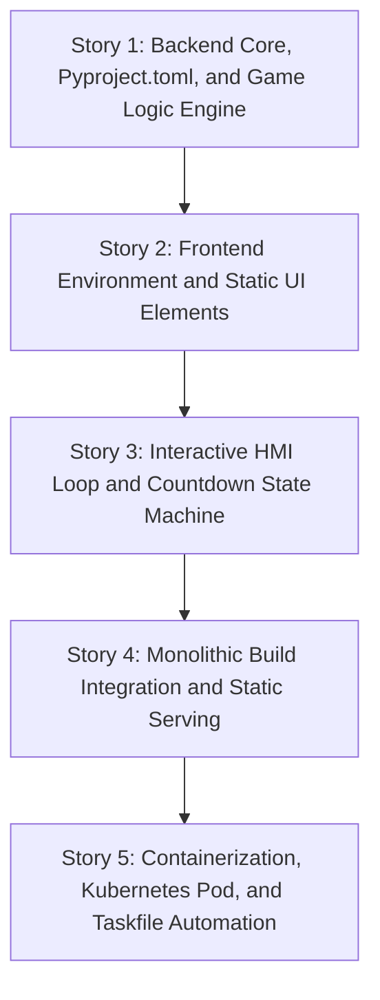

# Product Requirements Document (PRD)

## Title: PRD-RPSLS: Rock-Paper-Scissors-Lizard-Spock Web Game
**Date**: 2026-06-25

---

## 1. Executive Summary & Objective
The objective of this project is to build a containerized, web-based "Rock-Paper-Scissors-Lizard-Spock" (RPSLS) game. The system comprises a modern FastAPI backend in Python and a strictly-typed React frontend in TypeScript styled with Tailwind CSS. It is configured to run locally via Podman Kube using a Kubernetes Pod manifest (`pod.yaml`) and automated via Go-Task (`Taskfile.yml`). The game logic (win/loss evaluation and random choice generation) is strictly executed on the backend to prevent frontend client cheating.

## 2. Problem Statement & User Story
* **Problem**: Playing classic Rock-Paper-Scissors is too simple, and users want a more complex game variant like Rock-Paper-Scissors-Lizard-Spock (as popularized by The Big Bang Theory). Additionally, they need a fair, robust, containerized, and easy-to-run client-server web app where win/loss evaluation is secure and cheat-proof.
* **User Story**: As a player, I want to play Rock-Paper-Scissors-Lizard-Spock against a cheat-proof computer opponent with real-time countdown feedback, visual selection highlighting, simultaneous choice reveal, score tallies, and match victory declaration, so that I can enjoy a fair, modern, and engaging web gameplay experience.

## 3. High-Level Requirements (CAP_SYS)
* **CAP_SYS_001**: A containerized FastAPI backend using UV for dependency and environment management.
* **CAP_SYS_002**: A type-safe TypeScript React frontend styled with Tailwind CSS, built and packaged using Bun.
* **CAP_SYS_003**: Fully containerized system components with separate, optimized Containerfiles for the frontend and backend.
* **CAP_SYS_004**: High-fidelity Kubernetes orchestration using a multi-container Pod manifest (`pod.yaml`) run locally via `podman play kube`.
* **CAP_SYS_005**: A Go-Task automation interface (`Taskfile.yml`) to orchestrate container building, Pod execution, and teardown.
* **CAP_SYS_006**: State-driven game loop execution including initial screen, countdown phase, background action phase, simultaneous reveal, score tallying, best of 3 match resolution, and match reset.

## 4. Detailed Functional Requirements (EARS)
These requirements map directly to the MBSE needs specification defined in `mbse/needs/needs.sysml`:
* **NEED_SYS_001**: The Web Game System shall implement a containerized client-server architecture comprising a React frontend container and a FastAPI backend container.
* **NEED_SYS_002**: The React frontend container shall be written in type-safe TypeScript.
* **NEED_SYS_003**: The React frontend container shall define all game states and API payloads using strict TypeScript interfaces.
* **NEED_SYS_004**: The React frontend container shall use Bun as the package manager, test runner, and build tool.
* **NEED_SYS_005**: The React frontend container shall be styled using Tailwind CSS.
* **NEED_SYS_006**: The backend container shall use Python with the FastAPI framework.
* **NEED_SYS_007**: The backend container shall use UV as the Python environment and package manager.
* **NEED_SYS_008**: The backend container shall define all dependencies and project metadata within a pyproject.toml file.
* **NEED_SYS_009**: The backend container shall randomly generate the computer's selection from the five game choices.
* **NEED_SYS_010**: The backend container shall evaluate the outcome of each game round to prevent client-side manipulation.
* **NEED_SYS_011**: The Web Game System shall provide an optimized Containerfile for the React frontend container and an optimized Containerfile for the FastAPI backend container.
* **NEED_SYS_012**: The Web Game System shall provide a Kubernetes Pod manifest file named pod.yaml defining the frontend and backend containers running in the same Pod.
* **NEED_SYS_013**: The Kubernetes Pod manifest shall configure host port mapping to allow external access to the React frontend container.
* **NEED_SYS_014**: The Web Game System shall provide a Taskfile.yml defining automated tasks to build the container images, start the Pod using Podman, and stop the Pod.
* **NEED_SYS_015**: The backend container shall evaluate round outcomes according to the classic Rock-Paper-Scissors-Lizard-Spock game rules:
  - Scissors cuts Paper
  - Paper covers Rock
  - Rock crushes Lizard
  - Lizard poisons Spock
  - Spock smashes Scissors
  - Scissors decapitates Lizard
  - Lizard eats Paper
  - Paper disproves Spock
  - Spock vaporizes Rock
  - Rock crushes Scissors
* **NEED_SYS_016**: The React frontend container shall display an initial screen presenting a starting score of 0 wins for the player and 0 wins for the computer, alongside a control element to start the game.
* **NEED_SYS_017**: When the user initiates a game round, the React frontend container shall initiate a 5-second countdown timer.
* **NEED_SYS_018**: The React frontend container shall accept the player's choice from the five game options during the countdown timer.
* **NEED_SYS_019**: The backend container shall perform its random selection asynchronously during the countdown timer.
* **NEED_SYS_020**: The React frontend container shall visually highlight the player's selection without displaying the evaluation outcome during the countdown timer.
* **NEED_SYS_021**: When the countdown timer expires, the React frontend container shall display the player's choice and the computer's choice simultaneously.
* **NEED_SYS_022**: The React frontend container shall display the text outcome of the evaluated round.
* **NEED_SYS_023**: The React frontend container shall explicitly display a statement that a tie round does not increment the win count.
* **NEED_SYS_024**: The Web Game System shall repeat game rounds until either the player or the computer reaches 2 wins.
* **NEED_SYS_025**: When either player or computer reaches 2 wins, the React frontend container shall declare the ultimate winner of the match with an appropriate victory or defeat message.
* **NEED_SYS_026**: When a match is completed, the React frontend container shall display a reset button that resets the scores and the game state to their initial values.

## 5. MBSE Baseline & Integration Analysis
* **Added Parts/Systems**:
  - SysML v2 Needs model created under `mbse/needs/needs.sysml`.
* **Modified Models**:
  - Logical and Physical architectures will be derived from this needs model in subsequent phases.
* **Blast Radius & Impact**:
  - Greenfield project with no pre-existing code, so there is zero risk of regressing existing features.

## 6. Non-Functional & Security Requirements
* **Cheat Prevention**: No evaluation logic or random generation is allowed on the frontend.
* **Type Safety**: Strictly enforced static type checking in both Python (using Pyright) and React (TypeScript).
* **Test Coverage**: Complete unit and integration test suites using Bun (frontend) and Pytest (backend) with a target of 100% code coverage.
* **Platform Independence**: Taskfile automation for executing `podman play kube` to run containerized pods seamlessly across Linux, macOS, and Windows with Podman.

## 7. Verification & Acceptance Criteria (Test Cases)
* **verify_game_rules**: Backend unit tests evaluating all 10 standard win/loss outcomes and tie cases.
* **verify_countdown_flow**: Frontend unit/integration tests confirming the 5-second timer transitions through Initial -> Countdown -> Reveal -> Resolution.
* **verify_cheat_proofing**: E2E or backend tests verifying that the client receives the result only after transmitting the player's choice.
* **verify_pod_deployment**: Kubernetes integration test confirming both containers run inside the single pod and that host port forwarding is correct.

## 8. Detailed Implementation Plan & Proposed Issues

To achieve our "unified-monolith" game baseline, the implementation is decomposed into 5 chronological, vertical-slice user stories. These are designed to be independently verifiable and test-driven, moving sequentially from core game logic, to UI presentation, integration, and containerized deployment.

### Story Sequence & Dependency Map

---

### Story 1: Backend Core, Pyproject.toml, and Game Logic Engine
* **Title**: Story 1: Backend Core, Pyproject.toml, and Game Logic Engine
* **Type**: AFK
* **Blocked by**: None (can start immediately)
* **What to build**:
  Setup the Python backend environment and structure using UV as the package manager, with metadata and dependencies defined in a `pyproject.toml` file. Develop the core FastAPI application containing the endpoint for game evaluation and the asynchronous choice generation. Implement the full classic RPSLS rules engine that resolves player vs. computer choices. Write a comprehensive Pytest test suite to verify all 10 classic win/loss outcomes, tie cases, and asynchronous computer selection generation as described in the `rules_engine.feature` and `computer_choice.feature`.
* **Acceptance Criteria**:
  - [ ] The Python project is managed via UV, with a valid `pyproject.toml` file and a lockfile.
  - [ ] A FastAPI app is initialized and can be run.
  - [ ] The rules engine must implement the 10 classic game outcomes and tie cases:
    - Scissors cuts Paper (Player Win vs Computer Win)
    - Paper covers Rock (Player Win vs Computer Win)
    - Rock crushes Lizard (Player Win vs Computer Win)
    - Lizard poisons Spock (Player Win vs Computer Win)
    - Spock smashes Scissors (Player Win vs Computer Win)
    - Scissors decapitates Lizard (Player Win vs Computer Win)
    - Lizard eats Paper (Player Win vs Computer Win)
    - Paper disproves Spock (Player Win vs Computer Win)
    - Spock vaporizes Rock (Player Win vs Computer Win)
    - Rock crushes Scissors (Player Win vs Computer Win)
    - Ties (e.g., Rock vs Rock, Spock vs Spock) must be evaluated as tie rounds that do not count.
  - [ ] All 10 RPSLS rules evaluation outcomes must be fully covered by 100% passing Pytest unit tests mapping directly to `rules_engine.feature`.
  - [ ] Computer selection must randomly generate one of the five valid game choices (Rock, Paper, Scissors, Lizard, Spock). This must be covered by unit tests mapping to `computer_choice.feature`.
  - [ ] A test suite verifies that the computer's selection is kept hidden from the client during round initiation/countdown.
* **Out of Scope**:
  - Frontend development of any kind (Bun, React, Tailwind UI components are out of scope).
  - Building container images or Kubernetes pod definitions (out of scope).
  - Taskfile automation (out of scope).
  - Serving compiled frontend static files from the FastAPI app (out of scope).

---

### Story 2: Frontend Environment and Static UI Elements
* **Title**: Story 2: Frontend Environment and Static UI Elements
* **Type**: AFK
* **Blocked by**: Story 1: Backend Core, Pyproject.toml, and Game Logic Engine
* **What to build**:
  Initialize the React frontend environment using Bun as the package manager and build tool. Set up TypeScript for strict type checking and Tailwind CSS for styling. Design and implement the static UI layout containing the welcome screen, a scoreboard initialized to 0 wins for the player and 0 wins for the computer, and the static game choices (Rock, Paper, Scissors, Lizard, Spock). Ensure all interfaces and state models are defined with strict TypeScript types as described in `ui_presentation.feature` (Scenario 1).
* **Acceptance Criteria**:
  - [ ] The React frontend is initialized with Bun, containing `package.json` and strict TypeScript configurations.
  - [ ] Tailwind CSS is configured and integrated.
  - [ ] The welcome screen renders correctly in its initial state showing player's score as 0 and computer's score as 0 (Scenario: Initial game screen presentation and scoreboard rendering).
  - [ ] A "Start Game" control button is presented.
  - [ ] When the game is in its initial state, selection options (Rock, Paper, Scissors, Lizard, Spock) are rendered but are disabled/not interactive.
  - [ ] Static elements are fully tested using Bun's built-in test runner with mock/test specifications.
* **Out of Scope**:
  - Interactive timer countdown, active player choosing mechanics, score increments, and game loops (all out of scope, implemented in Story 3).
  - API integration with backend endpoints (out of scope, mocked or left for Story 3).
  - Production monolithic build compilation and FastAPI integration (out of scope, left for Story 4).
  - Production containerization or Kubernetes manifests (out of scope, left for Story 5).

---

### Story 3: Interactive HMI Loop and Countdown State Machine
* **Title**: Story 3: Interactive HMI Loop and Countdown State Machine
* **Type**: AFK
* **Blocked by**: Story 2: Frontend Environment and Static UI Elements
* **What to build**:
  Connect the frontend and backend using an interactive HMI loop and a synchronized countdown state machine. Implement the 5-second countdown timer that triggers when "Start Game" is clicked. Enable the selection options during the countdown, allow the player to select one of the five choices, visually highlight the player's choice, and make an asynchronous call to the backend to generate and evaluate the computer's selection. Upon countdown expiration, simultaneously reveal both choices, display the evaluated round outcome, update the scoreboard (with best-of-three match logic), handle tie rounds properly, declare the ultimate winner when 2 wins are reached, and provide a reset button to start a fresh match.
* **Acceptance Criteria**:
  - [ ] Clicking "Start Game" transitions the game from the welcoming screen to the countdown state, initiating a 5-second countdown timer (Scenario: Starting the game triggers countdown and timer tick).
  - [ ] During countdown, choice buttons (Rock, Paper, Scissors, Lizard, Spock) are enabled.
  - [ ] Selecting a choice visually highlights it while keeping the evaluation outcome hidden until the countdown expires (Scenario: Visual countdown and selection highlights during active round).
  - [ ] Upon timer expiration, the game transitions to the reveal/evaluation state, showing the player's choice and computer's choice simultaneously (Scenario: Simultaneous choice reveal and round outcome display).
  - [ ] The UI displays the correct round winner and explanation message returned from the backend rules engine.
  - [ ] Scoreboard tracks and displays wins. If either reaches 2 wins, the match is terminated and the ultimate winner is declared (Scenario: Score limits and match termination).
  - [ ] A reset button is shown upon match completion. Clicking it resets scores to 0-0 and transitions back to the initial welcoming state (Scenario: Match reset clears score and starts fresh).
  - [ ] Tie rounds are handled, and a message explicitly states that a tie round does not increment the win count.
  - [ ] Full client-server interaction is verified by unit and integration tests under Bun and Pytest.
* **Out of Scope**:
  - Production monolithic build compilation (out of scope).
  - Running frontend static files directly from the backend server (out of scope).
  - Docker/Containerfiles, Kubernetes pod yaml, and Go-Task files (out of scope).

---

### Story 4: Monolithic Build Integration and static file serving
* **Title**: Story 4: Monolithic Build Integration and static file serving
* **Type**: AFK
* **Blocked by**: Story 3: Interactive HMI Loop and Countdown State Machine
* **What to build**:
  Integrate the compiled React frontend into the FastAPI backend as a unified monolith. Configure Bun's production build/bundling system to compile the frontend assets into a static directory. Update the FastAPI application to mount and serve these compiled frontend static files (HTML, JS, CSS) using Python's static serving middleware. This allows the entire game (both backend APIs and frontend UI) to be run and served on a single host and port.
* **Acceptance Criteria**:
  - [ ] Bun builds production-ready static assets (e.g., using `bun run build` or similar) into a target dist/build directory.
  - [ ] The FastAPI backend uses `fastapi.staticfiles.StaticFiles` to mount the static assets folder.
  - [ ] Running the backend FastAPI server locally allows access to the complete, fully functional game UI at `/` (root), with API routes nested (e.g., under `/api`).
  - [ ] No separate development server is required for the frontend to communicate with the backend.
  - [ ] Static file serving configuration is validated via automated integration tests.
* **Out of Scope**:
  - Docker/Container packaging (out of scope, handled in Story 5).
  - Local Kubernetes Pod deployment configurations (out of scope, handled in Story 5).
  - Taskfile development (out of scope, handled in Story 5).

---

### Story 5: Containerization, Kubernetes Pod, and Taskfile Automation
* **Title**: Story 5: Containerization, Kubernetes Pod, and Taskfile Automation
* **Type**: AFK
* **Blocked by**: Story 4: Monolithic Build Integration and static file serving
* **What to build**:
  Package the unified monolith into container images using optimized Containerfiles. Design a high-fidelity Kubernetes Pod manifest (`pod.yaml`) defining the containers and correct host port mapping for external access. Create a Go-Task automation configuration (`Taskfile.yml`) to script container building, Pod execution via Podman (`podman play kube`), and teardown. This provides a single-command orchestration interface for local development and verification.
* **Acceptance Criteria**:
  - [ ] Optimized Containerfiles are created (one for frontend, one for backend, or a unified multi-stage Containerfile for the monolith as specified by the "unified-monolith" model).
  - [ ] A `pod.yaml` manifest defines the multi-container pod running locally.
  - [ ] The `pod.yaml` manifest correctly maps host ports to externalize access to the game.
  - [ ] A Go-Task `Taskfile.yml` is provided and includes tasks to build the container images, run the pod (using `podman play kube`), and stop/clean up the pod.
  - [ ] Running the task command successfully starts the containerized unified game monolith.
  - [ ] Verification of deployment is automated and tested.
* **Out of Scope**:
  - Production deployment to public clouds or external Kubernetes clusters (out of scope).
  - Multi-tenant authentication or database persistence (out of scope).

## 9. Workflow State & Checklist of Activities
* **Current Workflow State**: **Phase 4: Planning & Backlog Refinement**

### Checklist of Activities:
- [x] Phase 1: Feature Initialization & Refinement (Compile PRD, checkout branch, model needs, validate MBSE)
- [x] Phase 2: Logical Architecture Development (Derive requirements, model logical components, functional behaviors, halt for User Control Gate)
- [x] Phase 3: Physical Architecture Candidates & UX (Develop candidates, pros-cons matrix, UI wireframes, halt for User Selection Gate)
- [x] Phase 4: Backlog Refinement & Plan Development (Decompose plan, sequence stories, finalize backlog)
- [ ] Phase 5: Package Approval Gate (Awaiting written plan approval, record sign-off)
- [ ] Phase 6: Multi-Subagent Feature Implementation (Develop, verify, document each ticket)
- [ ] Phase 7: QA & Verification (Audit test reports, ensure zero regressions)
- [ ] Phase 8: Release Preparation & Versioning (Update version.txt, stage/package release)
- [ ] Phase 9: Human Peer Review (Await human peer sign-off, run /pr-done closeout)

### Approval Sign-off Log:
| Phase Name | Approved By (Git / OS Username) | Date | Status / Notes |
|---|---|---|---|
| **Phase 2: Logical Architecture** | *Pending* | *Pending* | *Pending* |
| **Phase 3: Physical Candidate** | *Pending* | *Pending* | *Pending* |
| **Phase 5: Package Approval** | *Pending* | *Pending* | *Pending* |
| **Phase 9: Peer Review** | *Pending* | *Pending* | *Pending* |
